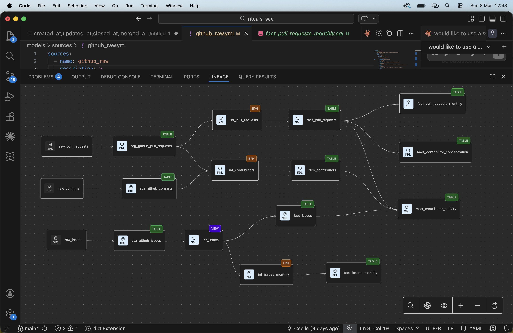

# dbt-core GitHub Activity Analytics

## A note on AI use

I used AI assistance in two areas of this project.

For the ingestion script, I have limited Python experience and no prior experience with API pagination, so I relied on AI to write the code. The design choices — what to extract, how to handle incremental loads, and what to store — are mine. The implementation was AI-assisted.

For the dbt project, the data model design, KPI definitions, and logic are entirely mine. I used AI for help with style consistency, naming, filling in repetitive parts of YAML files, generating markdown tables and documentation, error checking, and researching how the GitHub API response objects are structured.

---

## I. Overview

An end-to-end analytics pipeline tracking contribution activity on the [dbt-core](https://github.com/dbt-labs/dbt-core) open-source repository.

**Stack**
- **Ingestion**: Python script pulling from the GitHub REST API → BigQuery raw tables
- **Transformation**: dbt (Fusion or Core)
- **Destination**: BigQuery

**What it tracks**
- Monthly issue resolution health (open/close ratio, MoM trend)
- Monthly PR cycle time trend
- Quarterly contributor concentration (bus factor)
- Commit, pull request, and issue activity (start date configurable, defaults to 2023)
- Contributor profiles (human vs bot)

---

## II. Setup

### Prerequisites

- **Python 3.9+**
- **Google Cloud project** with BigQuery enabled
- **Google Application Default Credentials (ADC)** configured — see the [ADC setup guide](https://cloud.google.com/docs/authentication/provide-credentials-adc)
- **dbt** — either [dbt Fusion](https://docs.getdbt.com/docs/fusion) or [dbt Core](https://docs.getdbt.com/docs/core/installation-overview) with the `dbt-bigquery` adapter

### Steps

**1. Configure environment variables**

```bash
cp .env.example .env
```

Edit `.env` and fill in your values:

```
GCP_PROJECT=your-gcp-project-id
BQ_DATASET=your-bigquery-dataset
GITHUB_TOKEN=ghp_your_token_here
SINCE=2023-01-01          # load data from this date onward
```

`SINCE` is used as the initial watermark. On subsequent runs, the script queries BigQuery for the latest GitHub timestamp already stored (e.g. `updated_at` for issues and PRs, `commit.committer.date` for commits) and uses that as the lower bound.

**2. Install Python dependencies**

```bash
pip install -r requirements.txt
```

**3. Load raw data from the GitHub API**

```bash
python scripts/load_github_activity.py
```

This writes three raw tables to BigQuery: `raw_commits`, `raw_pull_requests`, `raw_issues`. The script is incremental — re-running it only fetches new activity.

**4. Run the dbt project**

```bash
dbt build
```

**5. (Optional) Generate and browse the project docs**

Requires dbt Core with the BigQuery adapter installed (dbt Fusion does not support `docs generate`). If you don't have it:

```bash
pip install dbt-bigquery
```

Then:

```bash
dbt docs generate && dbt docs serve
```

This opens an interactive browser at `http://localhost:8080` with model descriptions, column definitions, and the lineage graph.

---

## III. Data model overview

The core layer follows Kimball dimensional modeling (dims and facts). Denormalized marts sit on top for direct analysis.

### Dimensions

| Model | Grain | Primary key |
|---|---|---|
| `dim_contributors` | One row per GitHub user | `author_id` |

### Facts

| Model | Grain | Primary key |
|---|---|---|
| `fact_pull_requests` | One row per pull request | `pr_number` |
| `fact_issues` | One row per issue | `issue_number` |
| `fact_issues_monthly` | One row per calendar month | `month` |
| `fact_pull_requests_monthly` | One row per calendar month | `month` |

### Marts

| Model | Grain | Primary key |
|---|---|---|
| `mart_contributor_concentration` | One row per quarter | `quarter` |
| `mart_contributor_activity` | One row per active human contributor | `author_id` |

---

## IV. KPIs

### KPI 1 — Issue resolution health (`fact_issues_monthly`)

**Question:** Is the team keeping up with incoming issues?

Each month, we count how many issues were opened and how many were closed. The ratio `closed / opened` tells us if the backlog is growing or shrinking:
- Above 1 → more issues closed than opened (backlog shrinking)
- Below 1 → more issues opened than closed (backlog growing)

The month-over-month change shows whether things are improving or getting worse.

Bots and the current (incomplete) month are excluded.

---

### KPI 2 — PR cycle time (`fact_pull_requests_monthly`)

**Question:** How fast are pull requests being merged?

For each month, we calculate the average time (in hours) between a PR being opened and being merged. A lower number means faster code review and integration.

The month-over-month change flags acceleration or slowdown trends.

Draft PRs, bot PRs, and the current month are excluded.

---

### KPI 3 — Contributor concentration (`mart_contributor_concentration`)

**Question:** How many contributors does the project depend on?

Each quarter, we rank contributors by number of merged PRs and find the minimum number of people who together account for 80% of all merged PRs. A lower number means higher concentration — the project depends heavily on a small group, which is a bus factor risk.

Draft PRs, bot PRs, and the current (incomplete) quarter are excluded.

---

### Testing and documentation

All primary keys are tested for uniqueness and non-null values. Every source table, staging model, and mart/fact column is documented in `schema.yml`. Descriptions are automatically propagated to BigQuery table and column metadata via `persist_docs`.

### Lineage



---

## V. Design decisions, tradeoffs, and future improvements

### Design decisions

**Materialization**

- **Staging → table.** Raw data is stored as JSON in BigQuery. Parsing it on every downstream query would be redundant, so staging models are materialized as tables to parse once and store the result. This is a deliberate override of the dbt default (views).
- **Intermediate → view by default, ephemeral when consumed only once.** `int_issues` stays as a view because two downstream models read from it. The others (`int_pull_requests`, `int_contributors`, `int_issues_monthly`) are ephemeral — they are merged into the query that uses them and leave no object in the database.
- **Marts and facts → table.** Final output models are materialized as tables for fast, direct querying.
- **Partitioning and clustering** were considered but not applied. With a single repository since 2023, the tables are too small to benefit. If scaled to multiple repositories, `fact_pull_requests` would partition on `merged_at`, `fact_issues` on `created_at`, both clustered on `author_id`.

**Raw table design**
All three raw tables are partitioned by `loaded_at` (day) and clustered by `record_id`. This makes deduplication queries in dbt cheaper and prepares the tables for incremental loading.

**Layered architecture**
The project follows the standard dbt layered approach: staging cleans and parses raw data, intermediate holds shared business logic reused across multiple models, and the marts layer is the final output.

**Kimball structure**
Within the marts layer, the project follows Kimball dimensional modeling: a single dimension (`dim_contributors`) and transaction facts (`fact_pull_requests`, `fact_issues`) with periodic snapshot facts for trend analysis (`fact_issues_monthly`, `fact_pull_requests_monthly`).

Denormalized marts (`mart_contributor_concentration`, `mart_contributor_activity`) sit on top of these as ready-to-use aggregates.

**Incomplete period exclusion**
All KPIs exclude the current month or quarter, as partial periods would make trends misleading.

**Testing strategy**
Tests are applied at two levels: staging (where data enters the pipeline) and marts (where data is consumed). Primary keys are tested for uniqueness and non-null values at both levels. Testing at staging catches bad raw data early; testing at marts catches logic errors introduced during transformation. Intermediate models are not tested directly as they are ephemeral and covered by downstream mart tests.

---

### Tradeoffs

- **KPI 2 (cycle time) is noisy.** A single large PR can spike the monthly average. PR size metrics (lines changed) would help distinguish a slow month from a month with unusually large PRs, but they are not available from the list API endpoint.
- **KPI 3 (80% threshold) is arbitrary.** The 80/20 rule is a common convention but not a hard standard. The threshold is hardcoded for now.
- **Months with zero activity are missing.** If no issue was opened or closed in a given month, that month will not appear in `fact_issues_monthly`. A dim_date would fix this.
- **Bot exclusion is heuristic.** A contributor is flagged as a bot if the GitHub API type is `'Bot'` or the login contains `'bot'`. This catches most automated accounts but may miss some edge cases.
- **`dim_contributors` only covers code contributors.** It is built from commits and pull requests, not issues. People who only opened issues have no entry in `dim_contributors`, so `fact_issues` cannot be fully enriched with contributor attributes. A proper solution would build a separate `dim_users` from all three activity types.

---

### Future improvements

- **Incremental staging models** — commits PRs and issues staging models could be made incremental to reduce build time and API calls.
- **Calendar (dim_date)** — ensure all months appear in monthly aggregates, even with zero activity.
- **Richer PR metrics** — call the individual PR endpoint to retrieve lines added/deleted and files changed.
- **Source freshness** — add freshness checks on raw tables so stale data is detected before the pipeline runs.
- **Configurable thresholds** — expose the `is_active` window and the 80% concentration threshold as dbt variables.
- **Label-based issue segmentation** — break down issue counts by label (e.g. `bug`, `enhancement`) for more actionable insight.
- **Multi-repo support** — add a `repo` dimension to track multiple repositories in the same pipeline, at which point partitioning and clustering on fact tables would become worthwhile.
